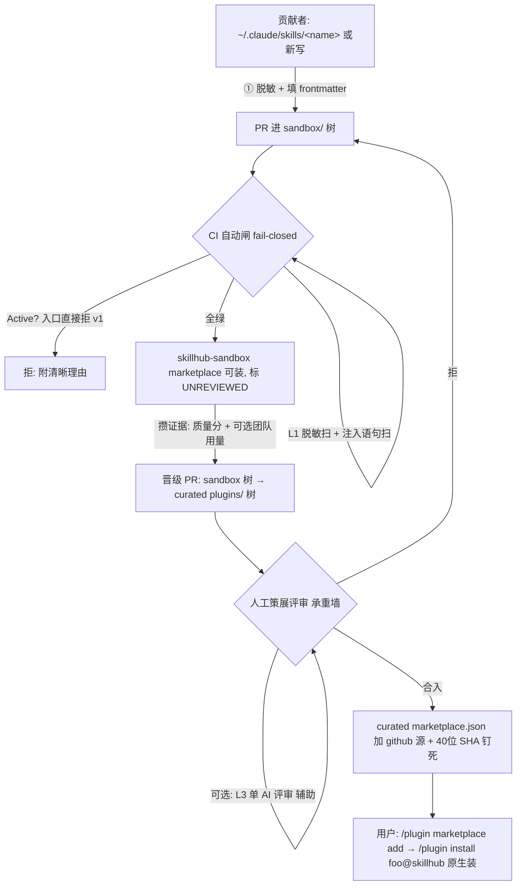

# Skill Hub Design

> 本设计已对照 Claude Code 官方文档查实（plugin-marketplaces / discover-plugins / plugins-reference / settings），并经一轮对抗式评审。凡依赖**特定 CC 版本**或**单一来源**的机制，文中都明确标注「需对目标版本验证」。

## Overview

### 一句话

skillhub 是**骑 Claude Code 原生 plugin marketplace 分发**的社区技能中心：人手写（可借 AI 起草）的 skill 经 PR 进 **sandbox marketplace**，过 CI 自动闸 + **人工策展合入**后晋级进 **curated marketplace**，任何人原生一行装。

### 设计中最重要的一个决定：只有一个地基（single substrate）

评审揭穿了初稿的根本矛盾——它脚踩两条互不相通的运行时：

- **原生 plugin 路线**：skill 作为 `plugins/<plugin>/skills/<skill>/SKILL.md`，由 Claude Code 自己的加载器安装与调度（`/plugin install foo@skillhub`）。这是真实用户唯一会走的路（满足 R1.2「不依赖自建运行时」）。
- **旧 memoket 机器**：`install`/`lockfile`/`quarantine`/`integrity`、`mcp_server` 的 `search`/`get` 用量写回、`registry.json`、`evolution.json` 计数——全部跑在另一个 `vault/` 世界。**原生安装永远不会调用它们。**

**结论（贯穿全设计）**：

1. **原生 marketplace 是唯一的安装与运行时路径。** 用户装的、跑的，只有原生 plugin。
2. **memoket 那套工具降级为「创作/CI 侧」工具**，只在 git 树（`sandbox/` 与 curated `plugins/`）上跑——validate、脱敏扫描、质量检查、scaffold。它**不进**任何终端用户机器。
3. **运行时安全用原生原语实现**：`defaultEnabled:false`（装而不启） + marketplace.json 里 **SHA 钉死** + workspace trust 对话框。**不是** memoket 的 `install`/`lockfile` quarantine。
4. **承重的安全控制是人工策展合入**，不是自动扫描——因为提示注入无法 100% 自动检测（R4.5）。自动闸只是「抬高攻击成本的过滤器」，不是「证明安全的闸门」。

### v1 范围（lean，对齐「别过度建设」）

| 决定 | v1 取舍 | 理由 |
|---|---|---|
| **Inert / Active** | **只收 Inert（纯指令 skill）**；Active（带 scripts/hooks/bin/MCP）在入口直接拒，给清晰提示 | Active 才需要最贵、最高风险的子系统（沙盒 jail、代码静态扫、blast-radius 分级）——在**没有任何一个真实 Active 需求**前建它，正是你砍掉自演变引擎时反对的「理想化建设」。三个种子全是 Inert，Inert-only 交付 ~100% 的 day-one 价值 |
| **安全流水线** | L0 validate（已有） + L1 脱敏扫（已有 `redaction.scan`） + L1 注入语句正则（**唯一要新写的小件**） + **一道人工策展合入**（承重墙）。L3 对抗式 AI 评审做成**可选/单评审**，L2/L4 沙盒 jail/代码扫**全部推后** | 自动闸过滤、人审定夺。N 评审多数投票留到贡献量把人审压成瓶颈时再上 |
| **两层 marketplace** | 表达为**两个具名 marketplace**（`skillhub` 策展 / `skillhub-sandbox` 沙盒），都从同一个 repo 提供 | 「装的时候能看见这是哪一层」唯一的原生信号就是 marketplace 名（无原生 per-plugin「未审」徽章） |
| **用量遥测** | **诚实承认原生路径无 per-skill 触发遥测**。v1 排名只用「策展 + PR + 质量分」这些 git 内信号；运行时用量做成**团队自愿 opt-in**（额外挂 memoket MCP）的未来项 | 原生加载器不认识 memoket，`record_use`/`record_surface` 不会触发；把它说成「免费」是错的 |
| **公开 stars/dependents 抓取** | **推后到开放阶段**，v1 不接 GitHub API | 团队阶段安装可控，高保真信号本就在 git 内；为一个还不存在的阶段维护一份空缓存是过度建设。留好接口（`registry` entry 的可选 `public_signals` 槽），将来加是增量 |
| **品牌/repo 名** | **确定 `skillhub`**（curated marketplace 名 = `skillhub`，沙盒 = `skillhub-sandbox`） | repo 已建，与 add 链接一致 |
| **种子技能** | 三个标杆（`psql-field-diagnostics` / `pr-description-craft` / `evidence-before-adoption`），`origin: ai-drafted-then-curated`；后续可纳入用户级手写技能 | 已质量评审过的高分样本 |
| **团队接入** | settings.json（`extraKnownMarketplaces`+`enabledPlugins`）为主，**但必须写明手动 `add` 回退**并验证目标 CC 版本 | 文档化的自动装流程有 closed-as-not-planned 的 bug #32606 |

> 这一节同时**回答了 requirements.md 的 5 个待确认点** + 评审逼出的「单一地基」决定。

---

## Architecture

### 端到端流（贡献者 → 用户）



### 两层 = 两个具名 marketplace（查实结论）

每个 `marketplace.json` 定义**恰好一个** marketplace 名；plugin 安装时命名空间是 `plugin@marketplace-name`。所以层级区分只能落在**名字**上，而名字正是用户安装那一刻看得见、要手敲的东西。Anthropic 自己就是这个模式（`claude-plugins-official` 自动可用 / `claude-plugins-community` 手动 add）。

| | curated（`skillhub`） | sandbox（`skillhub-sandbox`） |
|---|---|---|
| catalog 文件 | repo 根 `.claude-plugin/marketplace.json` | `sandbox/.claude-plugin/marketplace.json`（同一 repo，另一路径/子目录） |
| 源类型 | **`github` 源 + 显式 40 位 `sha`**（可钉死、防篡改，对齐 Anthropic 社区市场） | 相对路径 `./...`（廉价；**注意：相对路径源无法 SHA 钉死**——沙盒本就不承诺） |
| 内容 | 已策展、已评审的 Inert skill | 人人可 PR、**仅 Inert/skills-only**（无自动运行代码，与 CC 版本无关地安全） |
| 标注 | 正常 | `description` 前缀 `[SANDBOX/UNREVIEWED]` + `category:"sandbox"` / `tags:["unreviewed"]` |
| 启用 | 评审后可 `defaultEnabled` 正常 | skills-only 无需启停；若将来含代码则 `defaultEnabled:false`（需 CC ≥ v2.1.154，见版本依赖） |
| 接入 | `/plugin marketplace add <repo>` | **另行**显式 `add` 沙盒——刻意的一步，层级即知情同意 |

> **R2.1 措辞调整**：原文「sandbox/ 与 marketplace/ 两区**物理隔离目录**」改为「两个**具名 marketplace** + 各自的技能树物理隔离」。物理隔离仍成立（两个 catalog、两棵树），但对用户可见的层级信号是 marketplace 名，不是目录名。

### 安装即运行？——执行时机与风险（查实）

- **add / install 不跑插件代码**：add 只克隆 catalog；install 只把插件拷进本地 cache。
- **执行绑定「启用 + 会话生命周期」**，不是「首次用到才跑」：启用的插件，其 **MCP server 在会话开始即启动**、**hooks 按声明事件触发**（`SessionStart` 能在会话起点跑 `npm install`），**以用户权限、无沙盒**运行。**这就是 Active 的核心风险**，也是 v1 不收 Active 的根本原因。
- **原生 quarantine = `defaultEnabled:false`**：装而不启，代码不跑，直到用户显式启用。但它**版本门槛 v2.1.154+**，旧版本忽略此字段、装即启用。**所以 v1 的真正保证是「沙盒层只收 skills-only」**——skill 是纯指令，不带任何自动运行代码,与版本无关地安全。

---

## Components and Interfaces

### 1. 分发组件（distribution）

- **curated `marketplace.json`**（root）：每个 entry `source: {source:"github", repo:"<owner>/skillhub", sha:"<40-char>"}`。**晋级 PR 合入后，把 entry 的 source 改成 github+合入 commit 的 SHA**（满足 R1.3「钉 commit SHA」——注意这条**在 marketplace.json 里实现，不在 memoket.lock**）。
  - ⚠️ 当前 scaffold 的种子 entry 用的是相对路径 `./plugins/memoket-core`，**无法 SHA 钉死**；首次正式发布前要转成 github 源。
- **sandbox `marketplace.json`**：相对路径源，skills-only。
- **团队 settings.json 片段**（R1.4）：提供 `extraKnownMarketplaces` + `enabledPlugins`，**并排写手动回退**（见 Error Handling 的版本依赖）。

### 2. CI 自动闸（fail-closed，跑在 sandbox PR 上）

按顺序，任何一步红 = 不可合入；扫描器**出错也按失败处理**（fail-closed，无绿不合）。

| 闸 | 跑什么 | 复用模块 | 适用 | 改动 |
|---|---|---|---|---|
| **L0 结构** | `parse_skill` 结构解析 + `validate_skill`（schema + 触发场景 "Use when" + 正文非空） | `skill.py` / `schema.py` / `validate.py` | Inert | repoint 路径到 `sandbox/`、`plugins/` |
| **L0 批量** | `aggregate_validate`（隐私回归扫 + 允许的顶层文件检查） | `audit.py` | Inert | `_ALLOWED_TOP` 与 `_privacy_regression` 还硬编码旧 distill 产物名，要重指 |
| **L1 脱敏** | `redaction.scan`（email/url/phone/money/id/branch-ref/repo-path）；命中即 BLOCK（同 `publish` 的 `RedactionBlocked`） | `redaction.py` | Inert | **加 URL 白名单**：合法引用 `code.claude.com` 等文档链接不该误杀 |
| **L1 注入语句扫** | **新写的小件**：仿 `redaction._PATTERNS` 的结构，扫提示注入语句（"忽略以上/disregard your instructions"、外发 URL、读 `.env`/`~/.ssh`/凭证、base64+curl/POST）。**扫 SKILL.md + 所有打包文本（含 `reference/`）**，不只正文 | 新模块 `injection_scan.py`（与 redaction 同形：返回 `[{type,match,line,file}]`） | Inert | 唯一需新建的代码件 |
| **L1 质量体检** | `deterministic_checks` + `floor_flags`（缺 Not-for、技术类无命令块、可执行信号过少、脱敏遗漏）。`avg < 3.0` 标注提醒——**advisory，人审定夺** | `quality.py` | Inert | repoint 路径 |
| **能力分级（Active 拦截）** | 检测顶层是否存在 `scripts/`/`hooks/`/`bin/`/`mcpServers/` 等 → 若有，**v1 直接拒**并提示「Active 暂不收」。frontmatter 自称 inert 但带代码目录 = manifest 不符，硬失败 | 扩展 `audit._ALLOWED_TOP` 的标记集 | both | 比初稿的 L2 简单：v1 只需「是不是 Active」，不需 blast-radius |

### 3. 人工策展合入（承重墙，对应 L4/R4.5）

- 晋级 = **一个把 skill 从 sandbox 树移到 curated `plugins/` 树 + 在 curated marketplace.json 加 SHA 钉死 entry 的 PR**，由人 review 后合入。**绝不自动晋级**（R2.4）。
- 合入的 merge commit 即不可篡改的 git 痕迹（谁、何时、晋级了什么——R2.5）。
- **provenance（R4.4）**：记录作者身份/来源（PR 作者、frontmatter `author`）。匿名/低信誉来源**只能留在 sandbox**，不得进 curated——这是真实缓解手段，不是 advisory。

### 4.（可选 v1）L3 对抗式 AI 评审

- 复用 `quality.py` 的编排范式（`assemble_review_request` 写 per-skill 请求 → N 个独立 reviewer 各 Write 一个 JSON 判定 → 确定性聚合），把评分 rubric 换成「能否劫持/外泄/带偏」。
- **v1 做成可选/单评审**:人审读 diff 本身就是真正的闸。贡献量上来后再升级成 N 评审多数投票。
- **安全要求**:L3 的 reviewer agent **本身就是在处理不可信输入**(被审内容可能注入它)。给它们**不带工具、只出结构化结论**的约束。

### 5. 创作侧工具（authoring）

- `scaffold.new_skill`：生成 schema 合规的 SKILL.md 骨架（`origin: authored`）。
- `validate` / `build` + `adapters/`：本地与 CI 一致的校验；编译到 claude-code 形态。
- `migrate.migrate_all`：SKILL.md 格式契约演进的迁移 runner。

### 6.（可选、团队自愿 opt-in）用量遥测层

诚实声明:**原生装的 skill 没有 per-skill 触发遥测**。想要团队用量的团队,可**额外挂 memoket MCP**(`search_skills`/`get_skill`),让检索/取用走它,从而写 `evolution.json` 的 `surfaced_count`/`used_count`,再用 `dashboard.py` 看板。这是 R3.4 说的「团队内优先、自愿」可选项,**不是 v1 默认、不是公开机制**。

### 复用模块总账（lean 内核 / 可选 / 砍掉）

| 处置 | 模块 |
|---|---|
| **KEEP(CI/创作内核)** | `skill` `schema` `validate` `audit`(adapt) `redaction` `quality`(adapt) `scaffold` `build` `migrate` `errors` `semver` `paths`(adapt) `adapters/*` `schemas/skill.schema.json` |
| **NEW(唯一新件)** | `injection_scan.py`(注入/危险语句扫,仿 redaction) |
| **可选(按需启)** | `index` `registry` `dashboard` `lifecycle`(adapt) `mcp_server`——仅用于团队自愿遥测/发现层;`feishu_notify`——仅团队要飞书推送(且要把 `tenant_token` 从被砍连接器里抽出) |
| **DROP(从用户运行时移除,原生替代)** | `install` `lockfile` `integrity`——原生 marketplace + SHA 钉死 + `defaultEnabled:false` 取代之 |
| **PRUNE(自演变大脑,明确砍)** | `distill` `cycle` `garden` `ingest` `connectors/*` `driver` `evals` `kernel` `tool_retro` `signals` `watermark` `profile` `budget` `locking` `review` `report` `locales` |

---

## Data Models

### SKILL.md frontmatter

沿用现有 schema(`tools/schemas/skill.schema.json`):必填 `name`(kebab) / `description`(含触发场景) / `version`(semver);可选 `format_version` `author` `tags` `origin` `status` `locales` `adapters`。

- `origin` enum 已扩为 `["authored","ai-drafted-then-curated","distilled","installed"]`;`distilled` 标为旧路径(低价值),保留作向后兼容,新技能不用。
- `status`:种子目前 `draft`。**注意**:旧 `publish_skill` 要求 `status=='active'` 才放行——晋级流程里要么晋级时把 status 翻成 `active`,要么放宽该断言(二选一,见 tasks)。

### marketplace.json entry

```jsonc
// curated（钉死、防篡改）
{ "name": "memoket-core", "source": { "source": "github", "repo": "liulejun511/skillhub", "sha": "<40-char-commit>" },
  "version": "x.y.z", "category": "engineering", "strict": true }
// sandbox（廉价、不承诺）
{ "name": "<contrib>", "source": "./plugins/<contrib>",
  "description": "[SANDBOX/UNREVIEWED] ...", "category": "sandbox", "tags": ["unreviewed"] }
```

### 两轴排名（v1 数据源 + 未来接缝）

| 轴 | 含义 | **v1 实际信号(git 内、原生可得)** | 推后(留接缝) |
|---|---|---|---|
| **热度(火不火)** | 采纳广度 | 晋级状态、curated 收录与否、PR/贡献活动 | 公开 `stars/forks/installs/dependents`(开放阶段);团队 `surfaced/used`(自愿 MCP) |
| **质量(好不好用)** | 复用/留存/被依赖 | `quality.{reusable,actionable,boundary,avg}`(CI/评审产出,存于技能旁) + `floor_flags` | `take_rate=used/max(surfaced,1)`、`reinforced_count`(自愿 MCP);公开评分/徽章/dependents(开放阶段) |

- **两轴永不压成单一分**(R3.1):热度高盖不住 take-rate 低。
- **公开信号**(开放阶段)存 `registry` entry 的可选 `public_signals:{stars,forks,installs,dependents,fetched_at,prev_*}` + `curation:{user_rating_avg,user_rating_count,badges[]}`;定时刷,绝不请求时拉;缺失记 `unknown` 不记 `0`。
- **防刷**(开放阶段附录,非 v1):跨 ≥2 独立信号交叉、速率异常守卫、recency 衰减、徽章/评分人工 git-traced、最小评分数门限。

### 晋级状态机(git 驱动)

`draft(sandbox)` →(晋级 PR)→ `sandbox-PR open` →(**人工合入**)→ `active(marketplace)` →(maintainer)→ `deprecated` →(delist PR)→ `archived`。

- 每次转移 = 一个 git-traced commit;archived 用 `git mv` 进归档、**绝不删**(可 `restore`)。
- `mcp_server`(若启用)搜索已自动跳过 deprecated/archived。

---

## Error Handling

| 场景 | 处理 |
|---|---|
| **CI 扫描器报错 vs 没发现** | **fail-closed**:扫描器异常按失败处理,无绿不合。区分「扫过=干净」与「没扫成」 |
| **脱敏/注入扫误杀**(如合法引用文档 URL) | redaction 加 URL 白名单;并提供**策展人可豁免**通道(在 PR 上标注 waive,留 git 痕迹) |
| **下架/吊销已被安装的副本** | **诚实承认原生限制**:delist 只删 catalog entry,**无法卸载已装副本**(原生无 push-revoke)。真正的「吊销」= 安全公告 + 版本 bump 触发重新 quarantine/重审。R4.2「下架机制」按此如实缩小承诺 |
| **晋级回滚** | revert 那个 merge commit(R2.5 的 git 痕迹天然支持) |
| **marketplace.json 损坏** | CI 加一步:对 catalog 跑 schema 校验(见 Testing) |
| **L3 reviewer 超时/被注入而拒答** | 视为「未通过自动闸」,落到人工(永不自动放行) |
| **版本依赖**(下方单列) | 设硬性最低 CC 版本 + 旧版本回退行为 |

### 依赖的版本门槛 CC 特性(单一来源,需对目标版本验证)

| 特性 | 需要版本 | 若旧版本 | 我们的对策 |
|---|---|---|---|
| `defaultEnabled:false`(装而不启) | v2.1.154+ | 装即启用 | **沙盒层只收 skills-only**——不靠此字段做保证 |
| 团队 settings.json 自动 prompt 装 | 文档化但有 bug **#32606**(closed-not-planned:只填缓存不真装) | 不装/skill 不可用 | **必写手动 `add`+`install` 回退**,并在目标版本上实测 |
| Will-install 审阅面板 / context-cost / displayName / last-updated | v2.1.143~145+ | 不显示 | 仅为 UX 增强,不承重 |

> 安全模型按**保守读法**设默认:假设「启用的 Active 代码在会话开始即无沙盒运行」。v1 不收 Active,绕开此风险。

---

## Testing Strategy

> 运行方式遵循项目约定:**pytest 经 WSL + `D:\capsoul\CapsoulAI\.venv`**(Windows 直跑无法 import 应用环境)。

1. **恶意技能语料(红队 fixture corpus)** —— 安全是头号需求(R4),必须有一组**已知坏样本**(注入语句、外发 URL、改写绕过、homoglyph、跨 `reference/` 文件藏指令)+ 期望 L1 判定。这是注入扫描器的**回归守卫**:改 patterns 时不许漏掉旧已知坏样本。
2. **能力分级 fixture** —— Inert/Active 判定的正负样本(含「自称 inert 却带 `scripts/`」的 manifest 不符样本必须被拒)。
3. **marketplace.json schema 校验测试** —— curated 与 sandbox catalog 都要对 Claude Code 的 marketplace schema 有效。
4. **晋级 PR 负向测试** —— 命中脱敏/注入时,promote-PR CI **确实 block**;fail-closed 在扫描器异常时**确实不放行**。
5. **L0/创作单测** —— `validate`/`build`/`scaffold`/`migrate` 的既有契约测试(随取舍裁剪掉已 prune 模块的测试)。
6. **手工验证** ——
   - 全新 Claude 会话:`/plugin marketplace add liulejun511/skillhub` + `/plugin install memoket-core@skillhub`,确认三个种子原生可触发。
   - 团队 settings.json 流程**在团队实际 CC 版本上实测**(因 #32606),确认装上且可用,否则走手动回退。

---

## 与 requirements 的对应 & 砍掉项

- **R1** 原生分发:two-marketplace + github/SHA 源(curated) / 相对路径(sandbox);R1.3 SHA 钉死在 marketplace.json 实现;R1.4 团队 settings.json + 手动回退。
- **R2** 贡献/晋级:two-marketplace 物理隔离;sandbox PR CI fail-closed;晋级 = 移树 PR + 人工合入(绝不自动);git 痕迹可回滚。
- **R3** 双轴:概念保留,v1 用 git 内质量/策展信号;运行时用量=自愿 opt-in,公开信号=开放阶段;诚实声明原生无免费遥测。
- **R4** 安全:**人工策展合入是承重墙**(因注入无法 100% 自动检测);L0+L1(脱敏+注入语句)自动过滤;Active v1 入口拒;provenance 限制低信誉来源进 sandbox;运行时靠原生 `defaultEnabled:false`+SHA+trust。
- **R5** 格式/质量:沿用 `SKILL.md`+schema+`validate`+`quality` 三维+脱敏闸。
- **R6** 团队种子/为公开而生:架构无单团队硬编码;开放=公开 repo + 公布 add 链接 + 接上 `public_signals`。
- **砍掉**(不变):`distill/cycle/garden/ingest/connectors/driver/evals/kernel/tool_retro/signals/watermark/profile` 等自演变大脑。**新增降级**:`install/lockfile/integrity` 退出用户运行时(原生替代)。

---

## 修订 (2026-06-22):per-skill 分发粒度 + 可视化目录

**问题**:把多个技能塞进一个插件(`memoket-core` bundle),用户一装就全加载、关不掉单个——「skills 越多越好」是反模式。查实(claude-code-guide):Claude Code **原生没有 per-skill 开关**,enable/disable/卸载只在**插件**粒度。

**决定**:**1 个技能 = 1 个插件**(curated 与 sandbox 都按此)。直接用原生能力满足用户诉求:
- **按需选装**:每个技能独立插件,用户只装想要的;
- **单独卸载**:`/plugin uninstall <skill>@skillhub`;
- **描述可视化**:每个插件的 `plugin.json.description` 即浏览器装前可见的说明(bundle 模式下浏览器只显示 skill 名、看不到各自描述,这也是必须拆开的理由);
- **上传自己的**:个人自用走原生 `~/.claude/skills/<name>/`(零市场);分享走 sandbox PR 流程。

**配套**:
- `promote` 改为「晋级 = 建独立插件 `plugins/<name>/` + 写 `plugin.json` + marketplace 追加 github/SHA 条目」(去掉 `--plugin` 参数)。
- 新增 `catalog`(`memoket catalog` → `CATALOG.md`):扫所有技能的 name/description/tags,出一页可浏览清单,让人不进 Claude 也能挑。

**代价**:marketplace 从 1 条 bundle 变「一技能一条目」(官方无数量上限),维护由 `promote` 自动化。

---

设计看起来可以吗?如果可以,我再生成实现任务。

(几个我已替你拍板、可推翻的点:① 只留原生地基、memoket 降为 CI 工具;② v1 只收 Inert;③ 两层用两个 marketplace 名;④ 用量遥测做成自愿 opt-in、公开抓取推后;⑤ per-skill 分发粒度 + catalog。有不同意的直接说,我改。)
