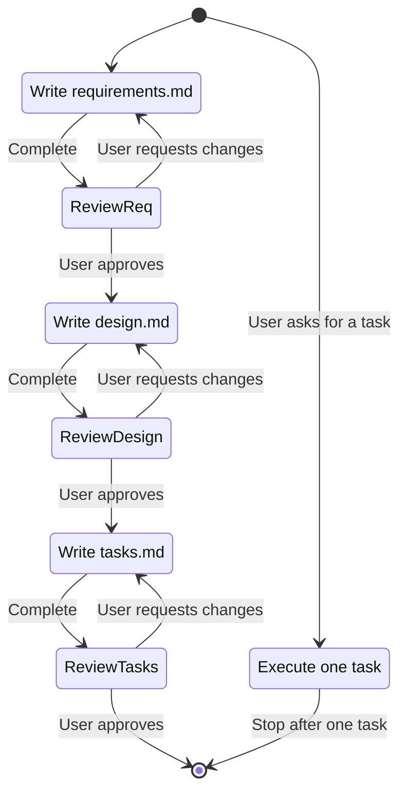
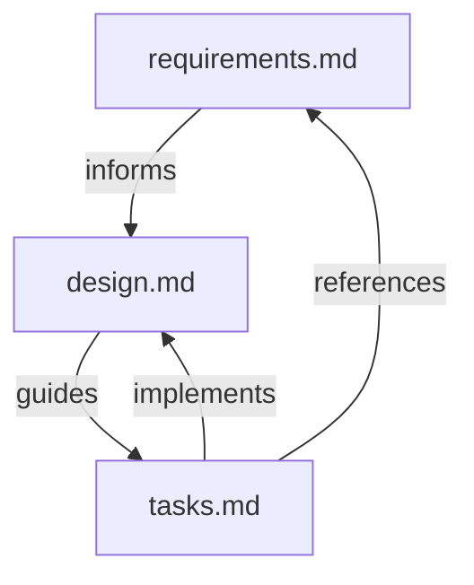
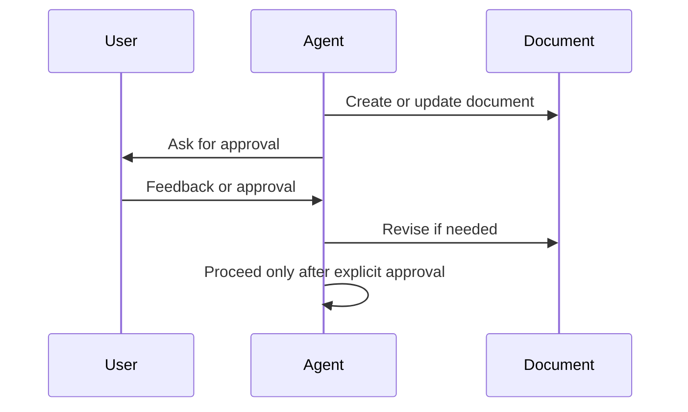

# Kiro Workflow Diagrams

## 主流程


```mermaid
stateDiagram-v2
  [*] --> Requirements

  Requirements : Write requirements.md
  Design : Write design.md
  Tasks : Write tasks.md
  Execute : Execute one task

  Requirements --> ReviewReq : Complete
  ReviewReq --> Requirements : User requests changes
  ReviewReq --> Design : User approves

  Design --> ReviewDesign : Complete
  ReviewDesign --> Design : User requests changes
  ReviewDesign --> Tasks : User approves

  Tasks --> ReviewTasks : Complete
  ReviewTasks --> Tasks : User requests changes
  ReviewTasks --> [*] : User approves

  [*] --> Execute : User asks for a task
  Execute --> [*] : Stop after one task
```

## 文件结构

```text
.kiro/
└── specs/
    └── {feature-name}/
        ├── requirements.md
        ├── design.md
        └── tasks.md
```

## 文档依赖


```mermaid
graph TD
  A[requirements.md] -->|informs| B[design.md]
  B -->|guides| C[tasks.md]
  C -->|references| A
  C -->|implements| B
```

## 批准门禁


```mermaid
sequenceDiagram
  participant U as User
  participant A as Agent
  participant D as Document

  A->>D: Create or update document
  A->>U: Ask for approval
  U->>A: Feedback or approval
  A->>D: Revise if needed
  A->>A: Proceed only after explicit approval
```
